<!-- CONTENT -->

<h1 align="center">
      
    LoCode Nodes and improvements
      
    for ComfyUI
</h1>

    <a href="#-the-nodes">Nodes</a> &nbsp; | &nbsp; <a href="#-side-bar">LoCode Side bar</a>

    A collection of nodes and improvements for ComfyUI. Created for my own needs to improve my workflow. Feel free to use this package if you find it useful.

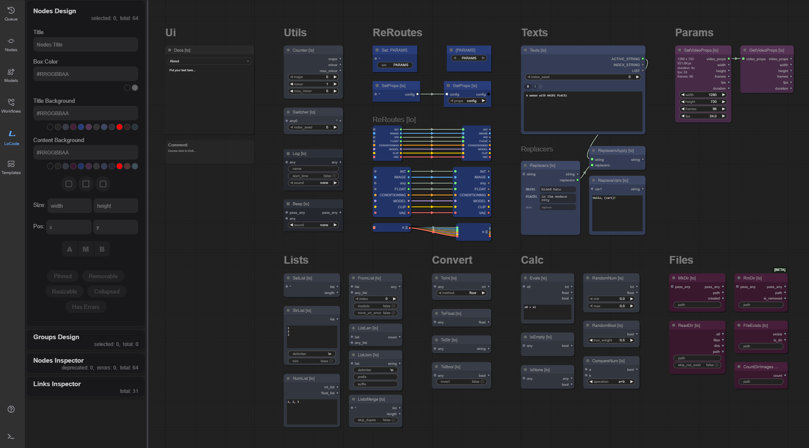

 

# Installation
Clone this repo into `custom_nodes` folder.

 

 

# **The Nodes**

ui/

## Comment [lo]

A node for creating beautiful comments in your workflow.

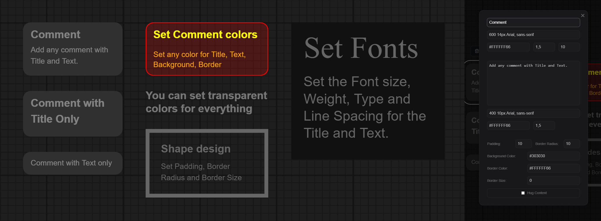

  
ℹ️ <i>More Information</i>

 

**Features:**
  - **Edit:** Double-click to edit the Comment node parameters.
  - **Set any colors** for Title, Text, Background and Border except transparent colors
  - **Set Fonts style** for Text and Title (size, weight, type, line spacing)
  - **Shape design** set Padding, Border Size and Radius

 

---

## Docs [lo]

A node for creating Markdown documentation as part of your workflow.

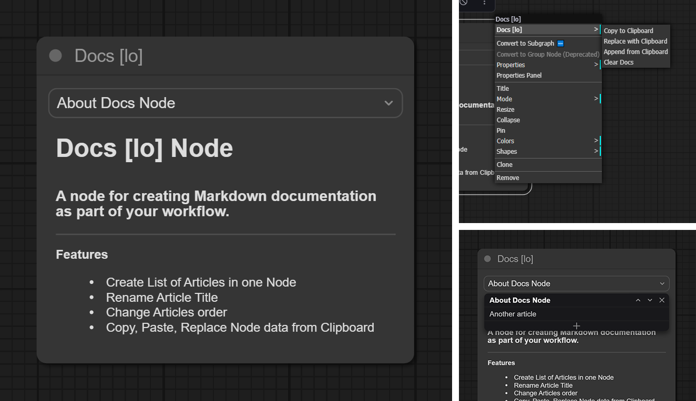

  
ℹ️ <i>More Information</i>

 

**Features**
- Create a list of Articles in a single node
- Rename an Article title
- Change the order of Articles
- Copy, paste, or replace node data from the Clipboard
- Double-click to edit text — allows you to select a section of text without entering edit mode

 

texts/

## Texts [lo]

An array of texts presented as tabs. Can be used to create a list of prompts.

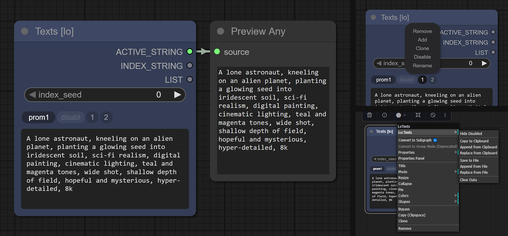

  
ℹ️ <i>More Information</i>

 

**Features:**
  - Add / edit tabs.
  - Temporarily disable a tab.
  - Hide disabled tabs.
  - Copy / paste node data from the clipboard.
  - Save / load node data to a JSON file on disk.
  - Indexes always wrap modulo, so an out-of-range index maps back into the list. For example, with index_seed=10 and 7 items, the index becomes 10 % 7 = 3.

|**Inputs**|Type|Description|
|-|-|-|
|`index_seed`|INT|index with wrap modulo.|

|**Outputs**|Type|Description|
|-|-|-|
|`ACTIVE_STRING`|STRING|text of the active tab|
|`INDEX_STRING`|STRING|text at the given index|
|`LIST`|LIST|full list of texts|

 

---

## Replacers [lo]
A list of `replacers` to replace text in a string.
Can be used immediately or in combination with the `ReplacersApply` node.

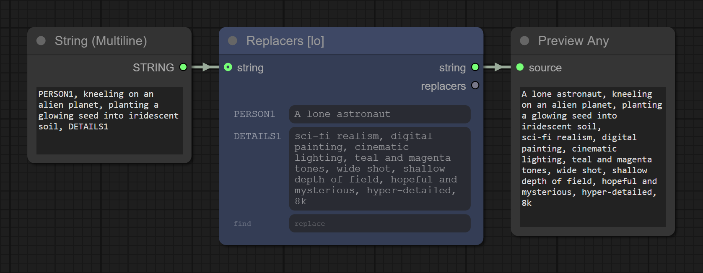

  
ℹ️ <i>More Information</i>

 

|**Inputs**|Type|Description|
|-|-|-|
|`string`|*|The any value that can be converted to `STRING` in which the search and replace is performed.|

|**Outputs**|Type|Description|
|-|-|-|
|`string`|STRING|String after replacements|
|`replacers`|LIST|List of replacers in the format [["find", "replace"], ...] for the `ReplacersApply` node|

 

 

---

## ReplacersApply [lo]

Applying replacers from `Replacers` node to a string.

  
ℹ️ <i>More Information</i>

 

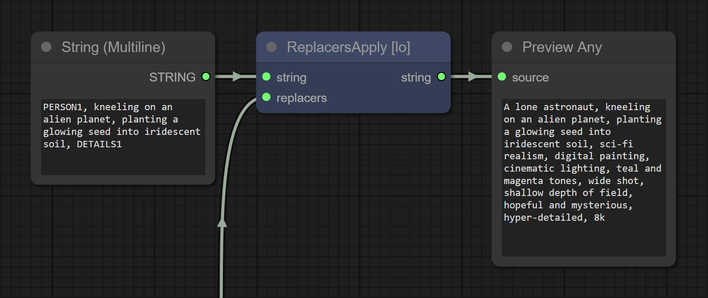

|**Inputs**|Type|Description|
|-|-|-|
|`string`|*|The any value that can be converted to `STRING` in which the search and replace is performed.|
|`replacers`|LIST|List of replacers in the format [["find", "replace"], ...]|

|**Outputs**|Type|Description|
|-|-|-|
|`string`|STRING|String after replacements|

 

 

---

## ReplaceVars [lo]

Replaces parameters in a string enclosed in curly braces, for example: `Hello, {var1}!`.

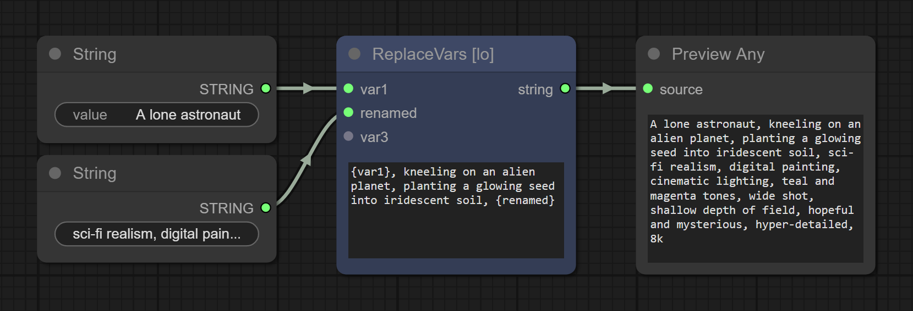

  
ℹ️ <i>More Information</i>

 

**Features:**
- The parameter name is taken from the input name (or label, if exists).
- You can redefine the parameter (input label) name using the `Context Menu > "Rename Slot"`.

|**Inputs**|Type|Description|
|-|-|-|
|`string`|*|The any value that can be converted to `STRING` in which the search and replace is performed|
|`var...`|*|Dynamic inputs with values to substitute|

|**Outputs**|Type|Description|
|-|-|-|
|`string`|STRING|Result string|

 

 

reroutes/

## ReRoutes [lo]

A node for rerouting multiple parameters. Based on the standard ReRoute node.

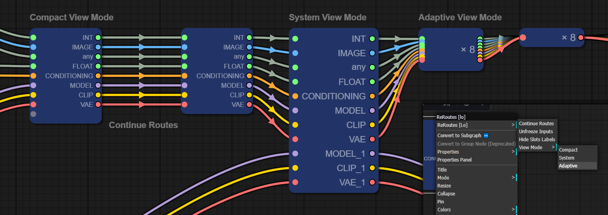

  
ℹ️ <i>More Information</i>

 

**Features:**
- Multiple display types (Compact, System, Adaptive).
- Freezing of input parameters.
- Hide/show slot names.
- "Continue Routing" function for cloning a node with attached slots.

 

---

## Set [lo] &rarr; Get [lo] 

A pair of nodes for setting/getting a list of parameters.

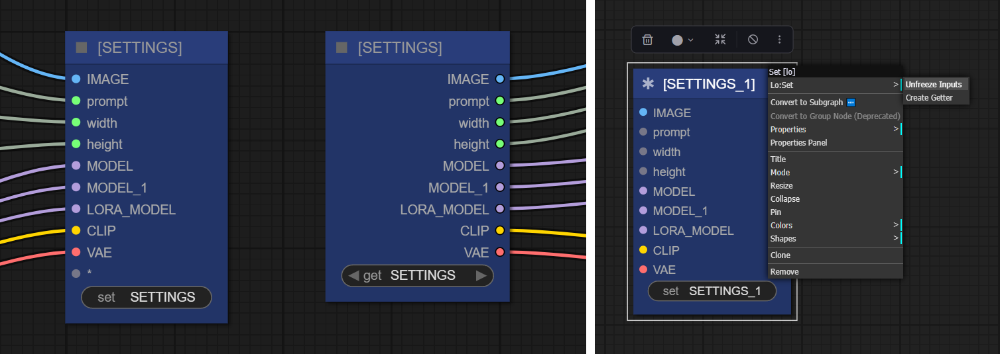

> **IMPORTANT:** Works only within a single graph. Will not work between graphs and subgraphs.

  
ℹ️ <i>More Information</i>

 

**Features**
- Freeze `Set` inputs so that the node persists when the input slot is disconnected. A freeze indicator will appear.
- Changing slot labels will also change them for getters.
- Ability to create a getter node via the `Set` context menu.

### **Set [lo]**

|**Inputs**|Type|Description|
|-|-|-|
|`any...`|*|Any number of parameters to pass to `Get` nodes|

### **Get [lo]**

|**Outputs**|Type|Description|
|-|-|-|
|`any...`|*|input parameters from `Set` node|

 

---

## SetProps [lo] &rarr; GetProps [lo] 

Node pair for passing an arbitrary list of parameters.
Allows you to pass an array of parameters through a single Link for a cleaner workflow.

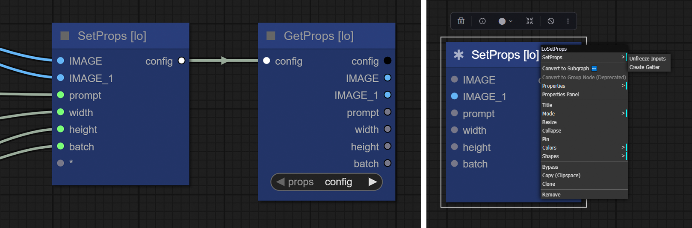

`SetProps` packs a list of dynamic inputs into an `LO_PROPS` object for later unpacking in the `GetProps` getter.

> **IMPORTANT:** The input data will be loaded into memory, so it is not recommended to use this node for large amounts of data.

  
ℹ️ <i>More Information</i>

 

**Features**
- Unlike `Set [lo]`, parameters can be passed between graphs and subgraphs.
- When unpacking in `GetProps`, it checks only data types, which allows using different `SetProps` nodes with the same data.
- Freeze `SetProps` inputs so the node persists when the input slot is disconnected. A freeze indicator will appear.
- Changing slot names (labels) will also change them for getters.
- Ability to create a `GetProps` node via the `SetProps` context menu.

#### **SetProps [lo]**

|**Inputs**|Type|Description|
|-|-|-|
|`any...`|*|Any number of parameters whose values will be passed into `GetProps`|

|**Outputs**|Type|Description|
|-|-|-|
|`props`|LO_PROPS|Input parameters object for later unpacking in `GetProps`|

#### **GetProps [lo]**

|**Inputs**|Type|Description|
|-|-|-|
|`props`|LO_PROPS|Packed object from `SetProps`|

|**Outputs**|Type|Description|
|-|-|-|
|`props`|LO_PROPS|Packed object from `SetProps`|
|`any...`|*|Unpacked parameters|

 

utils/

## Counter [lo]

Two-position counter.
Increments the `minor` value after the node is executed.
When `minor` becomes greater than `max_minor`, it resets to zero, and `major` is incremented.

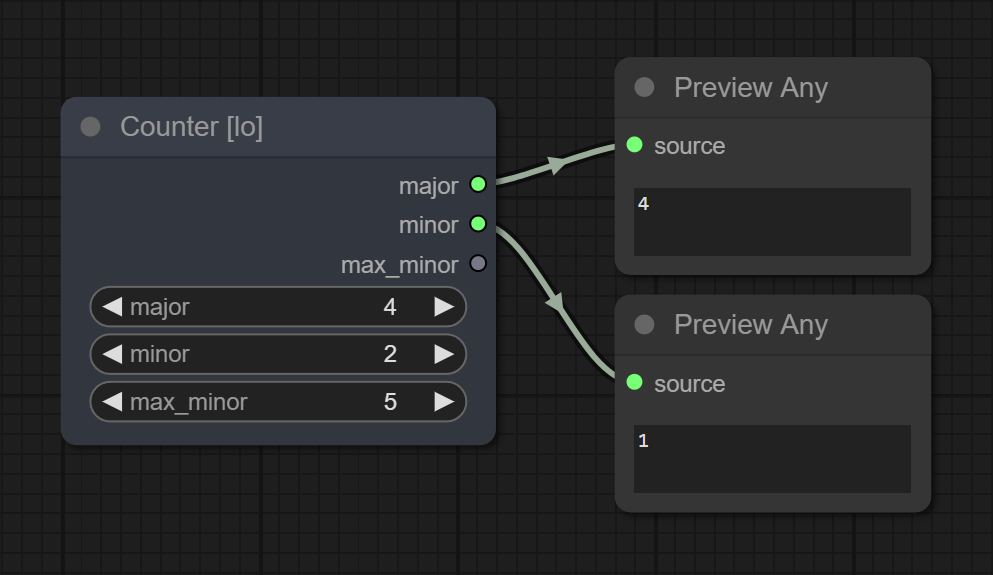

  
ℹ️ <i>More Information</i>

 

|**Inputs**|Type|Description|
|-|-|-|
|`major`|INT|The major value|
|`minor`|INT|The minor value|
|`max_minor`|INT|The maximum minor value|

|**Outputs**|Type|Description|
|-|-|-|
|`major`|INT|The major value|
|`minor`|INT|The minor value|
|`max_minor`|INT|The maximum minor value|

 

---

## Switcher [lo]

Selects a value from a list of values based on the `index_seed`.

  
ℹ️ <i>More Information</i>

 

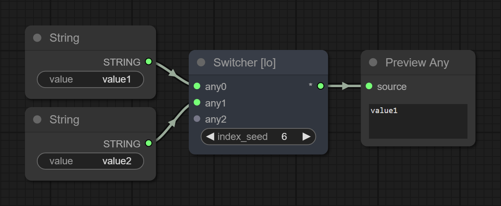

|**Inputs**|Type|Description|
|-|-|-|
|`index_seed`|INT|The index to select the value from the list|
|`any...`|*|Dynamic inputs|

|**Outputs**|Type|Description|
|-|-|-|
|`*`|*|Selected input value|

**Features:**
  - Supports lazy loading: asks ComfyUI to calculate only the required input..
  - The index_seed is wrapped using modulo. So if index_seed=10 and list has 7 items, then the result index will be 10 % 7 = 3.

 

---

## Beep [lo]

Plays a `sound` and passes the `pass_any` value further.

  
ℹ️ <i>More Information</i>

 

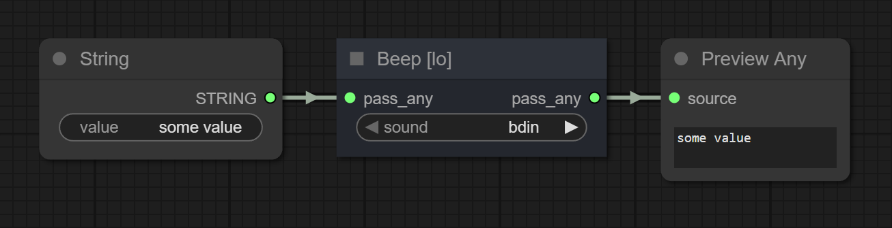

**Features:**
  - To add your own sound, place the file in `/res/beeps`.

|**Inputs**|Type|Description|
|-|-|-|
| `pass_any` | * | The value to pass further |
| `sound`| COMBO | The sound to play when the node completes|

|**Outputs**|Type|Description|
|-|-|-|
| `pass_any` | * | Passed value |

 

---

## Log [lo]

Outputs `any` value to the console. Outputs to the console the elapsed time since the last call to a node of this type.
Optional: Plays a `sound` alert when a node completes.

  
ℹ️ <i>More Information</i>

 

**Features:**
- To add your own sound, place the file in `/res/beeps`.

|**Inputs**|Type|Description|
|-|-|-|
| `any` | * | The value to log |
| `name` | STRING | The name of the log |
| `start_time` | BOOLEAN | If True, the time will be reset |
| `sound` | COMBO | The sound to play when the node completes |

|**Outputs**|Type|Description|
|-|-|-|
| `any` | * | The value |

 

lists/

## SetList [lo]

Converts any types into a List of any types.

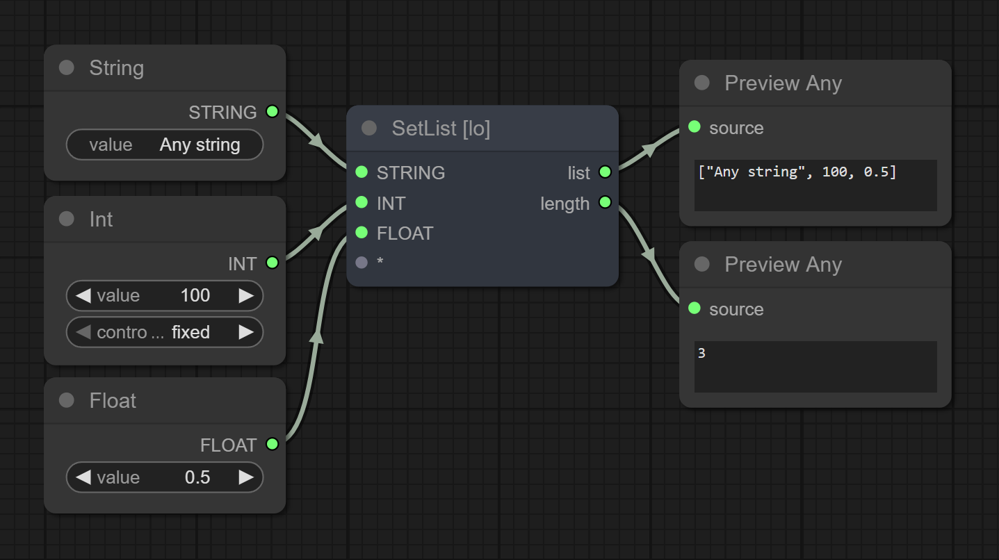

  
ℹ️ <i>More Information</i>

 

|**Inputs**|Type|Description|
|-|-|-|
|`any...`|*|Any connected slots become elements of the list.|

|**Outputs**|Type|Description|
|-|-|-|
|`list`|LIST|List|
|`length`|INT|List length|

 

---

## StrList [lo]

Converts a String into a List of Strings.

  
ℹ️ <i>More Information</i>

 

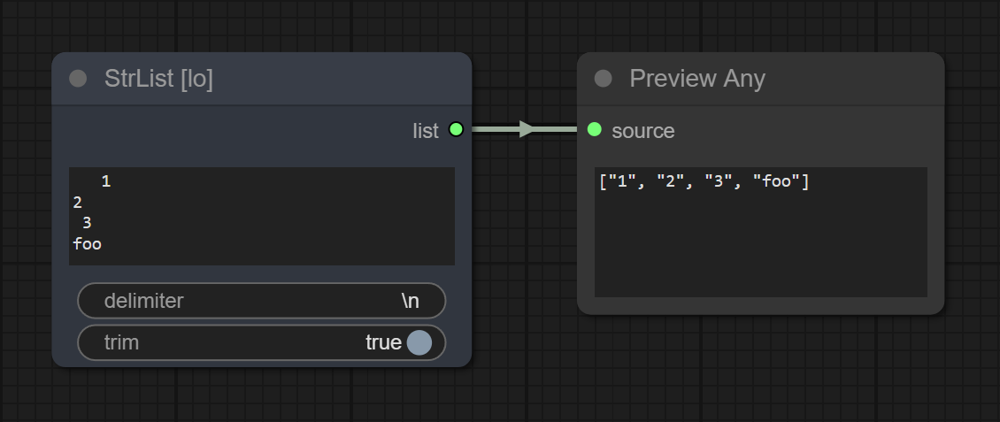

|**Inputs**|Type|Description|
|-|-|-|
|`string`|STRING|Multiline string|
|`delimiter`|STRING|Delimiter can be any string. You can use `\n` for new lines and `\t` for tabs.|
|`trim`|BOOLEAN|If `True`, trims whitespace at the start and end of each line|

|**Outputs**|Type|Description|
|-|-|-|
|`list`|LIST|List of strings|

 

---

## NumList [lo]

Converts a string of numbers into a list of Integers and Floats.
The delimiter is a comma.

  
ℹ️ <i>More Information</i>

 

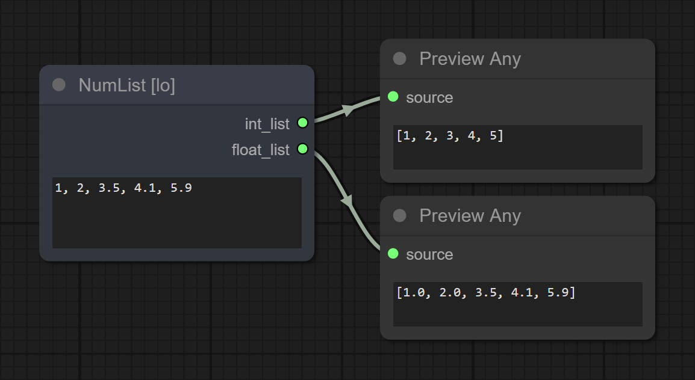

|**Inputs**|Type|Description|
|-|-|-|
|`string`|STRING|A string with numeric values separated by commas.|

|**Outputs**|Type|Description|
|-|-|-|
|`int_list`|LIST&lt;INT&gt;|List of Integers|
|`float_list`|LIST&lt;FLOAT&gt;|List of Floats.|

**Notes**
- Before parsing, removes everything except `0-9 + - . ,`.
- Collapses repeated commas and trims commas at the edges.

 

---

## ListsMerge [lo]

Merging any Lists or single values into one List.

  
ℹ️ <i>More Information</i>

 

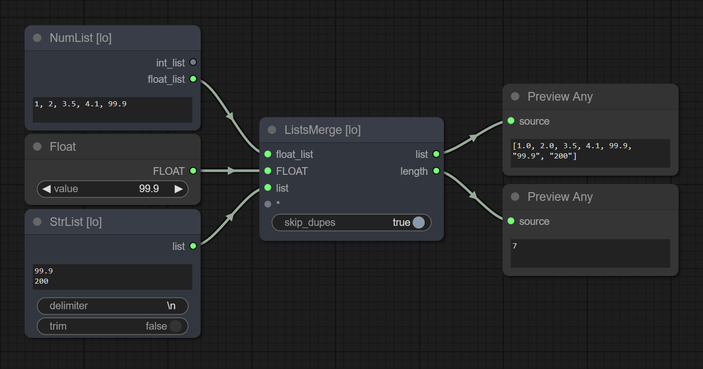

|**Inputs**|Type|Description|
|-|-|-|
|`skip_dupes`|BOOLEAN|Skips duplicate values.|
|`any...`|*|Any lists or single values. Single values are treated as one list element.|

|**Outputs**|Type|Description|
|-|-|-|
|`list`|LIST|Final list|
|`length`|INT|List length|

 

---

## FromList [lo]

Returns value from a List by the `index`.

  
ℹ️ <i>More Information</i>

 

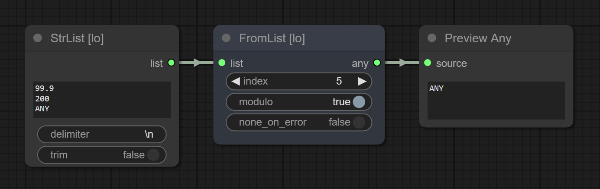

If `modulo` is set and the index is out of bounds in either direction, the index is wrapped using modulo. So if index=10 and list has 7 items, then the result index will be `10 % 7 = 3`.

|**Inputs**|Type|Description|
|-|-|-|
|`index`|INT|Index of the element in list|
|`list`|LIST|List of values|
|`modulo`|BOOLEAN|If enabled, wraps index using modulo operation (index % list_length).|
|`none_on_error`|BOOLEAN|If enabled, returns `None` instead of raising an error.|

|**Outputs**|Type|Description|
|-|-|-|
|`any`|*|Value from the list by index|

 

---

## ListLen [lo]

Count items in List

  
ℹ️ <i>More Information</i>

 

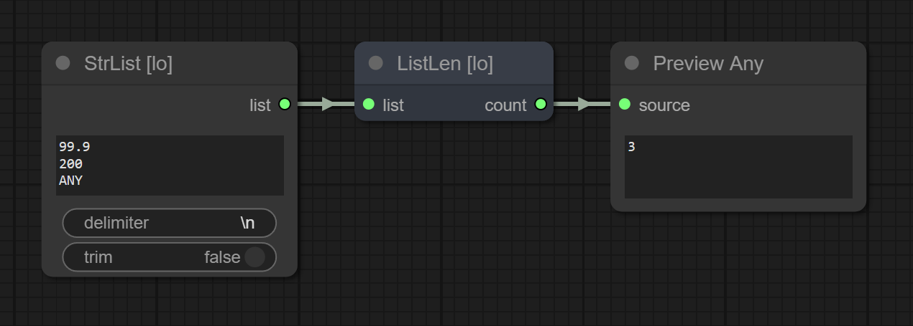

|**Inputs**|Type|Description|
|-|-|-|
|`list`|LIST|List of any types.|

|**Outputs**|Type|Description|
|-|-|-|
|`count`|INT|Number of items in the list|

 

---

## ListJoin [lo]

Join List into a string with a `delimiter`, `prefix` and `suffix`.

  
ℹ️ <i>More Information</i>

 

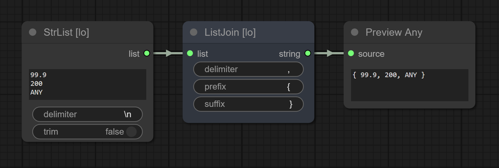

|**Inputs**|Type|Description|
|-|-|-|
|`list`|LIST|List of strings or any types.|
|`delimiter`|STRING|Delimiter can be any string. You can use `\n` for new lines and `\t` for tabs.|
|`prefix`|STRING|Prefix to add to the start of result string|
|`suffix`|STRING|Suffix to add to the end of result string|

|**Outputs**|Type|Description|
|-|-|-|
|`string`|STRING|Result string|

 

calc/

## Evals [lo]

Evaluates an python-expression with variables.

  
ℹ️ <i>More Information</i>

 

The variable name is taken from the input name (or label, if exists).
You can redefine the variable name (input label) using the context menu > "Rename Slot".

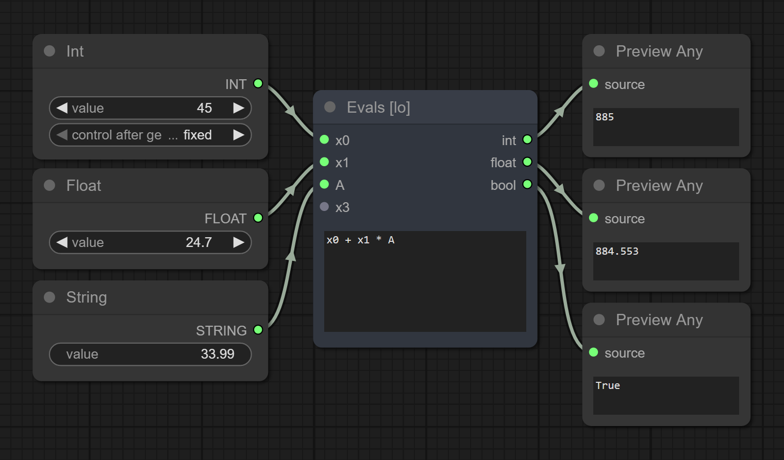

|**Inputs**|Type|Description|
|-|-|-|
|`expression`|STRING|Expression, for example `x0 + x1`|
|`x0...x999`|*|Any number of variables. The variable name is taken from the slot name, or from the label (if set).|

|**Outputs**|Type|Description|
|-|-|-|
|`int`|INT|Integer value|
|`float`|FLOAT|Floating value|
|`bool`|BOOLEAN|Boolean value|

 

---

## CompareNum [lo]

Compare two values `a` and `b` on the basis of `operation`.
Accepts any values that can be converted to a number.

  
ℹ️ <i>More Information</i>

 

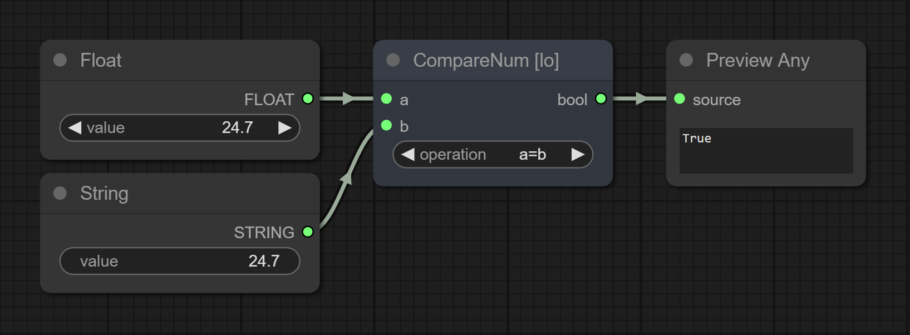

|**Inputs**|Type|Description|
|-|-|-|
|`a`|*|Any values that can be converted to a number.|
|`b`|*|Any values that can be converted to a number.|
|`operation`|COMBO|Comparison operations: `a>b`, `a<b`, `a=b`, `a!=b`, `a>=b`, `a<=b`, `a % b = 0`|

|**Outputs**|Type|Description|
|-|-|-|
|`bool`|BOOLEAN|Boolean value|

 

---

## RandomNum [lo]

Generates random integer and float values in the range `[min, max)`.

  
ℹ️ <i>More Information</i>

 

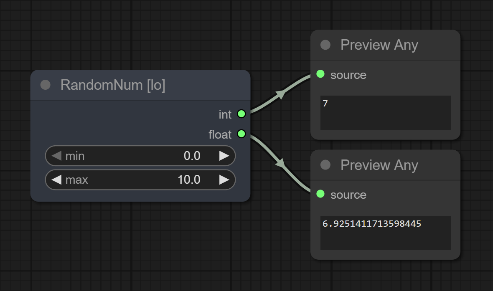

|**Inputs**|Type|Description|
|-|-|-|
|`min`|FLOAT|Minimum value|
|`max`|FLOAT|Maximum value|

|**Outputs**|Type|Description|
|-|-|-|
|`int`|INT|Rounded integer value|
|`float`|FLOAT|Floating-point value|

 

---

## RandomBool [lo]

Generate random Bool value with probability `true_weight`.

  
ℹ️ <i>More Information</i>

 

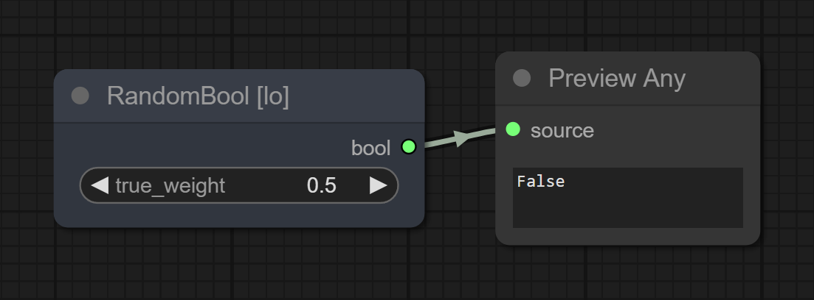

|**Inputs**|Type|Description|
|-|-|-|
|`true_weight`|FLOAT|Weight of `True` from `0.0` to `1.0`|

|**Outputs**|Type|Description|
|-|-|-|
|`bool`|BOOLEAN|Result|

 

---

## IsEmpty [lo]

Check value of any type for Empty.
Use `IsNone [lo]` to precisely check for None.

  
ℹ️ <i>More Information</i>

 

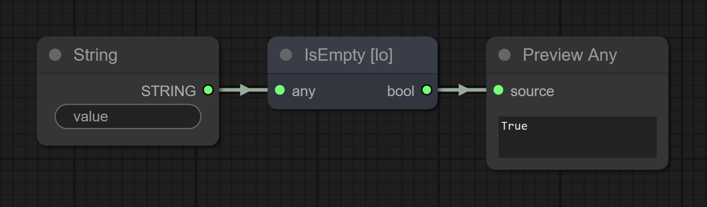

|**Inputs**|Type|Description|
|-|-|-|
|`any`|*|Value to check|

|**Outputs**|Type|Description|
|-|-|-|
|`bool`|BOOLEAN|Result|

**Check rules:**
- **None** → `True`
- **Empty Strings** → `True`
- **Empty Collection** (lists, dicts, sets, tuples) → `True`
- **any other type** → `False`

 

---

## IsNone [lo]

Checks the input value for `None` while passing through the original value.

  
ℹ️ <i>More Information</i>

 

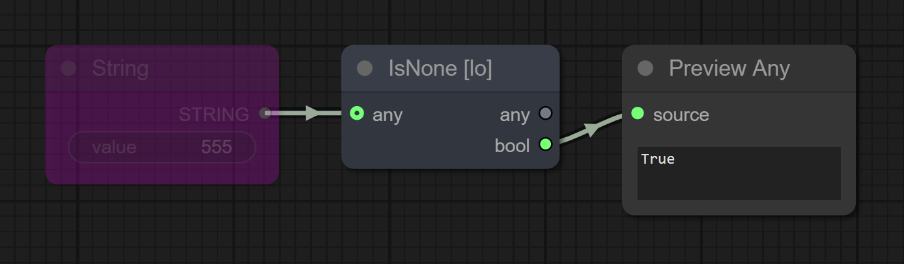

|**Inputs**|Type|Description|
|-|-|-|
|`any`|*|Any data type|

|**Outputs**|Type|Description|
|-|-|-|
|`any`|*|Original value|
|`bool`|BOOLEAN|Check result|

 

convert/

## ToInt [lo]

Converts any type to an `Integer` with rounding method.

  
ℹ️ <i>More Information</i>

 

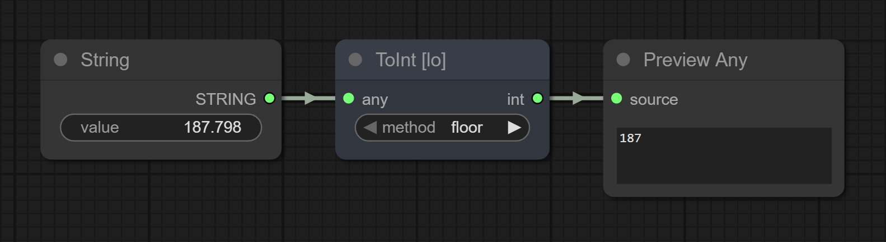

|**Inputs**|Type|Description|
|-|-|-|
|`any`|*|Any value that can be converted to a number|
|`method`|COMBO|Conversion methods: `floor` / `ceil` / `round`|

|**Outputs**|Type|Description|
|-|-|-|
|`int`|INT|Result|

 

---

## ToFloat [lo]

Converts any type to `Float` number.

  
ℹ️ <i>More Information</i>

 

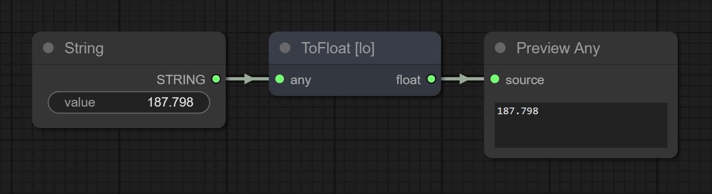

|**Inputs**|Type|Description|
|-|-|-|
|`any`|*|Any value that can be converted to a number|

|**Outputs**|Type|Description|
|-|-|-|
|`float`|FLOAT|Result|

 

---

## ToBool [lo]

Converts any type to Boolean.

  
ℹ️ <i>More Information</i>

 

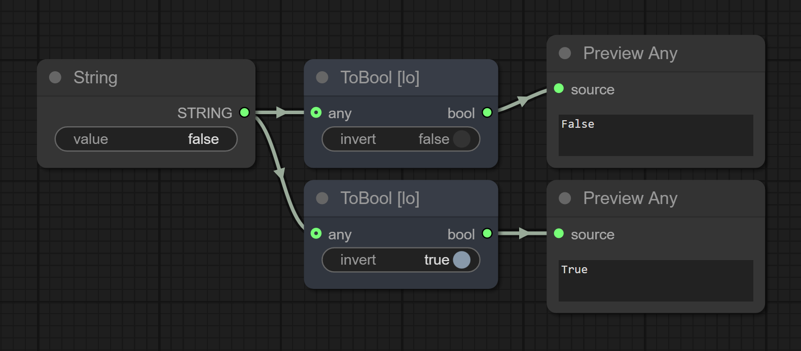

|**Inputs**|Type|Description|
|-|-|-|
|`any`|*|Any value that can be converted to `Boolean`|
|`invert`|BOOLEAN|Invert the result|

|**Outputs**|Type|Description|
|-|-|-|
|`bool`|BOOLEAN|Result|

**Conversion rules**
- **None** → `False`
- **Numbers**: `0` → `False`, any other number → `True`
- **Strings**:
  - "false", "0", "no", "off", "" (empty) → `False`
  - Any other non-empty string → `True`
- **Other types**:
  - Standard Python `bool()` conversion

 

---

## ToStr [lo]

Converts any type to a String.

  
ℹ️ <i>More Information</i>

 

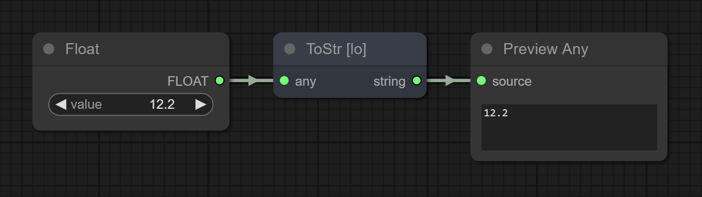

|**Inputs**|Type|Description|
|-|-|-|
|`any`|*|Any value|

|**Outputs**|Type|Description|
|-|-|-|
|`string`|STRING|Result|

 

system/

## MkDir [lo]

Creates a directory if it doesn't exist.

  
ℹ️ <i>More Information</i>

 

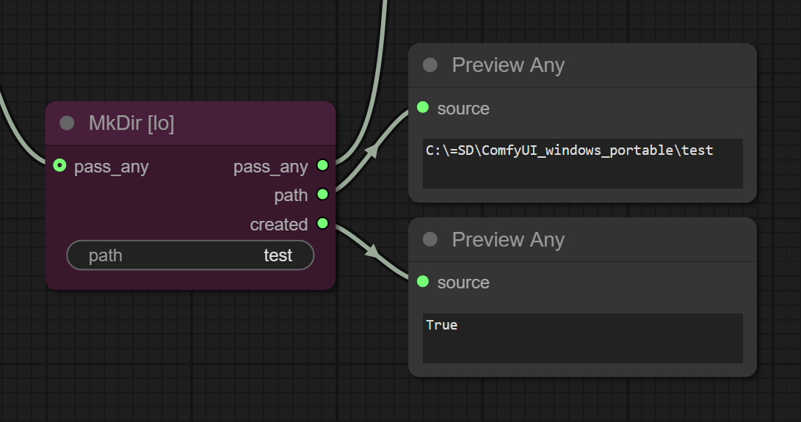

**Notes:**
- If the path is relative, it will be converted to an absolute path starting from the `ComfyUI folder`.

 

|**Inputs**|Type|Description|
|-|-|-|
|`pass_any`|*|Any value to pass|
|`path`|STRING|Path to the directory to create|

|**Outputs**|Type|Description|
|-|-|-|
|`pass_any`|*|Any value to pass|
|`path`|STRING|Absolute path to directory|
|`created`|BOOLEAN|Is directory created|

 

---

## ReadDir [lo]

Reads the contents of a directory.

  
ℹ️ <i>More Information</i>

 

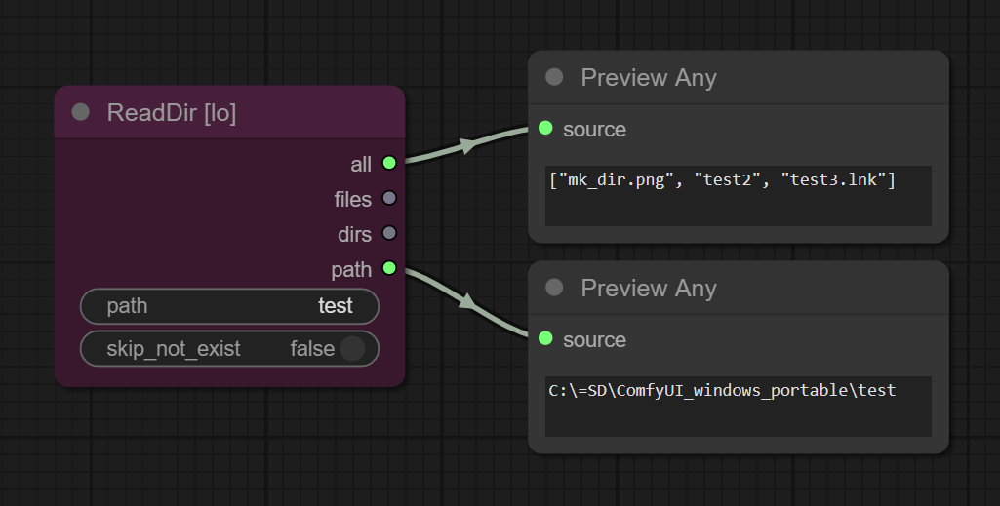

**Note:**
- If the path is relative, it will be converted to an absolute path starting from the `ComfyUI folder`.

 

|**Inputs**|Type|Description|
|-|-|-|
|`path`|STRING|Path to the directory to read|
|`skip_not_exist`|BOOLEAN|Don't throw error if directory does not exist and return empty lists|

|**Outputs**|Type|Description|
|-|-|-|
|`all`|LIST|All files and directories|
|`files`|LIST|Files only|
|`dirs`|LIST|Directories only|
|`path`|STRING|Absolute path to directory|

 

---

## FileExists [lo]

Checks if a file or directory exists.

  
ℹ️ <i>More Information</i>

 

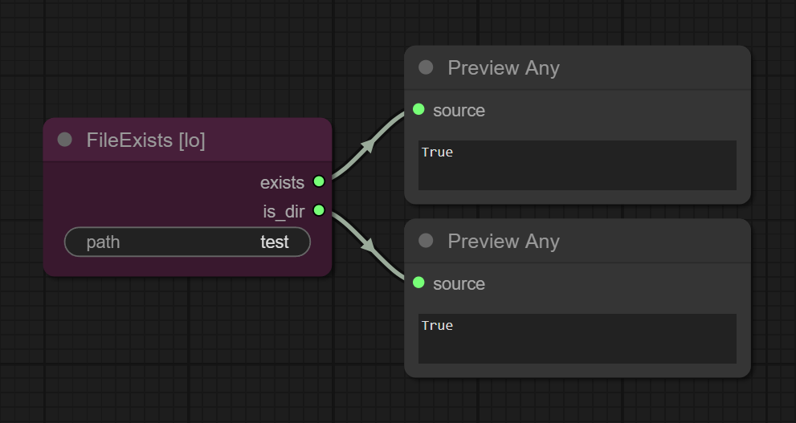

**Notes:**
- If the path is relative, it will be converted to an absolute path starting from the `ComfyUI folder`.

 

|**Inputs**|Type|Description|
|-|-|-|
|`path`|STRING|Path to file or directory|

|**Outputs**|Type|Description|
|-|-|-|
|`exists`|BOOLEAN|Whether the file/directory exists|
|`is_dir`|BOOLEAN|Whether the path is a directory|

 

---

## CountDirImages [lo]

Counts the number of images (`png`, `jpg`, `jpeg`, `webp`) in a directory.

  
ℹ️ <i>More Information</i>

 

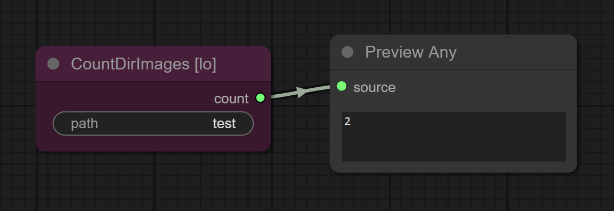

**Notes:**
- If the directory does not exist, or an error occurs, returns `-1`.
- If the path is relative, it will be converted to an absolute path starting from the `ComfyUI folder`.

 

|**Inputs**|Type|Description|
|-|-|-|
|`path`|STRING|Path to directory with images|

|**Outputs**|Type|Description|
|-|-|-|
|`count`|INT|Number of images|

 

---

## RmDir [lo]

Removes a directory and all its contents.

  
ℹ️ <i>More Information</i>

 

**Notes / warnings:**
- **Deletes everything inside the directory without confirmation.**
- If the directory does not exist, returns `False` without raising an exception.
- If the path is relative, it will be converted to an absolute path starting from the `ComfyUI folder`.

 

|**Inputs**|Type|Description|
|-|-|-|
|`pass_any`|*|Any value to pass|
|`path`|STRING|Path to the directory to remove|

|**Outputs**|Type|Description|
|-|-|-|
|`pass_any`|*|Any value to pass|
|`path`|STRING|Absolute path to directory|
|`is_removed`|BOOLEAN|Is directory removed|

 

params/

## SetVideoProps [lo] &rarr; GetVideoProps [lo] 

A pair of nodes for setting video parameters and their compact transmission.

  
ℹ️ <i>More Information</i>

 

### SetVideoProps

Packs video parameters into an `LO_VIDEO_PROPS` object. Calculates duration based on frame rate and frame rate.

|**Inputs**|Type|Description|
|-|-|-|
|`width`|INT|Width of the video|
|`height`|INT|Height of the video|
|`frames`|INT|Number of frames|
|`fps`|FLOAT|Frames per second|

|**Outputs**|Type|Description|
|-|-|-|
|`video_props`|LO_VIDEO_PROPS|The video properties object|
|`width`|INT|Width of the video|
|`height`|INT|Height of the video|
|`frames`|INT|Number of frames|
|`fps`|FLOAT|Frames per second|
|`duration`|FLOAT|Duration in seconds|

### GetVideoProps

Unpacks video parameters from a `LO_VIDEO_PROPS` object.

|**Inputs**|Type|Description|
|-|-|-|
|`video_props`|LO_VIDEO_PROPS|The video properties object|

|**Outputs**|Type|Description|
|-|-|-|
|`video_props`|LO_VIDEO_PROPS|The video properties object|
|`width`|INT|Width of the video|
|`height`|INT|Height of the video|
|`frames`|INT|Number of frames|
|`fps`|FLOAT|Frames per second|
|`duration`|FLOAT|Duration in seconds|

 

---

 

# **Side Bar**

## Nodes Design

Allows you to change various display parameters for selected nodes:
- Title
- Box Color
- Title Color
- Background Color
- Shape
- Size
- Position
- Pinned
- and more...

## Groups Design

Allows you to change various display parameters for selected groups:
- Title
- Font Size
- Color
- Size
- Position
- Pinned

## Nodes Inspector

- Lists nodes, including nodes inside subgraphs
- Shows the path to a node
- Allows you to jump to a node
- Highlights deprecated nodes and nodes with errors

## Links Inspector

- Lists links
- Shows the start node, end node, and slot number
- Allows you to jump to a node

